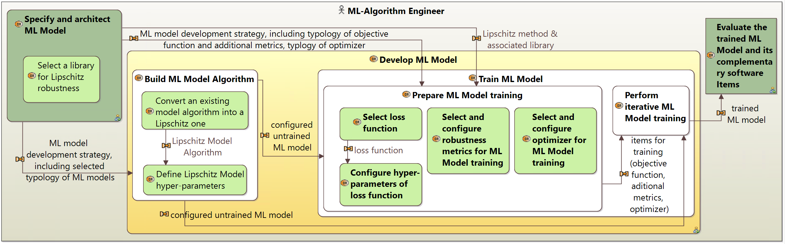
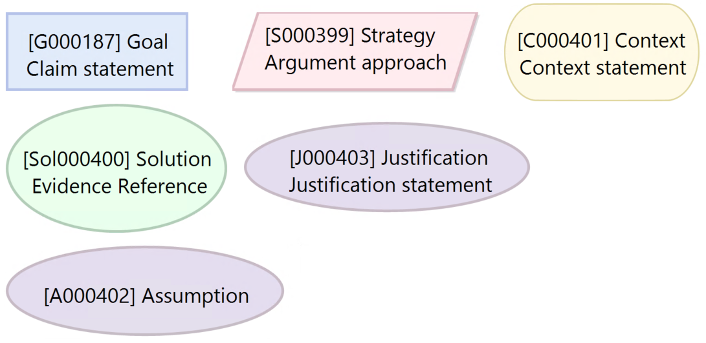

# ML-based_Assurance_Cases

This repository presents assurances cases for ensuring several trustworthiness properties on ML-based systems. These Assurance Case follow the Goal Structuring Notation (GSN) and are modeled using a dedicated plugin developed in the Capella Arcadia method, as described in the [associated paper published at ERTS 2024](https://scholar.google.com/citations?view_op=view_citation&hl=fr&user=f8gCWb0AAAAJ&sortby=pubdate&citation_for_view=f8gCWb0AAAAJ:Se3iqnhoufwC).

These assurance case are attached to the 'trained ML model' engineering item visible on the following Development workflow:

    

 

# Explainability assurance case:

    

 

# Robustness by design assurance case:

    

 

# Fairness assurance case:

    

 

# Enriched Workflow 
Here is an example of modification of the workflow when applying a specific strategy of our Robustness by design assurance case:

    

 

# LEGEND:

Here is the legend of the nodes used in our representation of assurance cases

    

